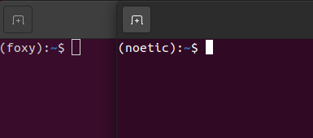

# Setup ROS env

Display the ROS environment on the terminal like pyenv.



## Setup 

```bash
$ cd ~
$ git clone https://github.com/Ar-Ray-code/setup_ros_env.git
$ bash setup_ros_env/setup.bash
>> Enter ros1-distro (e.g. noetic) : noetic
>> noetic
>> Enter ros1_workspace (abs path) : ~/ros1_ws
>> ~/ros1_ws
>> Enter ros2-distro (e.g. foxy) : foxy
>> foxy
>> Enter ros2_workspace(abs path) : ~/ros2_ws
>> ~/ros2_ws
```

## Automatic Setup

```bash
wget https://raw.githubusercontent.com/Ar-Ray-code/setup_ros_env/master/auto_setup.bash && bash auto_setup.bash && rm auto_setup.bash
>> Enter ros1-distro (e.g. noetic) : noetic
>> noetic
>> Enter ros1_workspace (abs path) : ~/ros1_ws
>> ~/ros1_ws
>> Enter ros2-distro (e.g. foxy) : foxy
>> foxy
>> Enter ros2_workspace(abs path) : ~/ros2_ws
>> ~/ros2_ws
```


 In "Enter ros2(or 1)_workspace (abs path):", enter the ROS workspace that contains the absolute path. If you Enter empty, the setting will be skipped.

## ROS Environment setup

### ROS1

```bash
example@example:~$ ros1_init
(noetic):~$
```

### ROS2

```bash
example@example:~$ ros2_init
(foxy):~$
```

## About writer

- Ar-Ray : Japanese student. 
- Blog(Japanese) : https://ar-ray.hatenablog.com/
- Twitter : https://twitter.com/Ray255Ar
